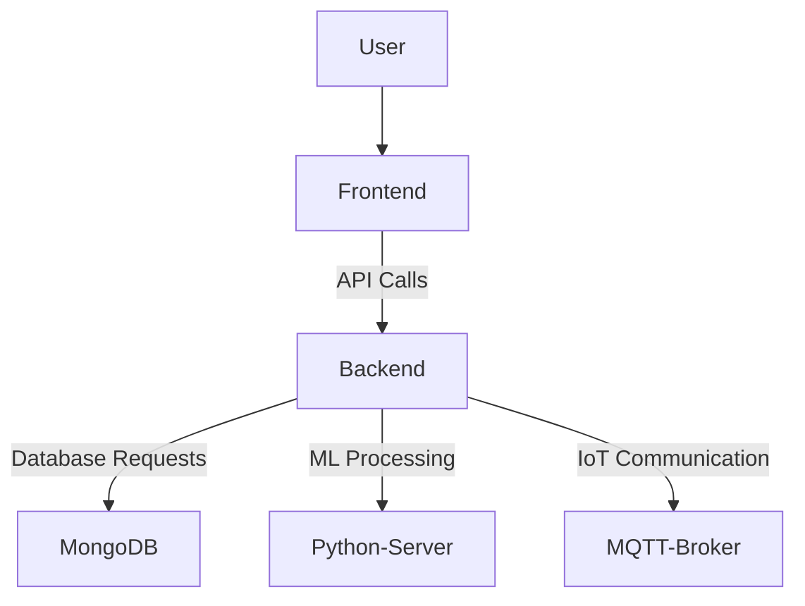

# 🗑️ Waste Management Automation for Dark Stores

## 🚀 Project Overview
**Waste Management Automation for Dark Stores** is an AI-powered web application designed to optimize waste tracking, reduce food wastage, and enhance sustainability in dark stores (micro-fulfillment centers). The system automates waste categorization, provides predictive analytics, and integrates with IoT sensors to monitor and reduce waste in real-time.

## 🏆 TROPHIES
[](https://github.com/ryo-ma/github-profile-trophy)


## 🏆 Hackathon Submission
- **Hackathon Name:** CodeClash2025
- **Problem Statement:** Waste Management Automation for Dark Stores
- **Team Name:** Coding Knights
- **Project Duration:** 24 Hours

## 🎯 Key Features
✅ **AI-Powered Waste Classification**: Automatically detects and classifies waste using image recognition.
✅ **Real-Time Waste Monitoring**: IoT-enabled sensors track waste levels and send alerts.
✅ **Predictive Analytics**: Machine learning models analyze trends to reduce wastage.
✅ **Inventory Expiry Alerts**: Prevents unnecessary waste by notifying about soon-to-expire products.
✅ **User Dashboard**: Provides waste insights, analytics, and reports.
✅ **Sustainability Score**: Tracks waste reduction performance over time.

## 🛠️ Tech Stack
### 🌐 Frontend:
- React.js (with Tailwind CSS for UI styling)
- Chart.js for data visualization

### ⚙️ Backend:
- Node.js with Express.js
- MongoDB for database storage
- Socket.io for real-time updates

### 🤖 AI & Automation:
- TensorFlow.js for waste classification
- Python (Flask) for predictive analytics
- OpenCV for image processing

## 🔧 Installation & Setup
1. **Clone the Repository**
   ```sh
   git clone https://github.com/your-username/waste-mgmt-darkstores.git
   cd waste-mgmt-darkstores
   ```
2. **Install Dependencies**
   ```sh
   npm install  # Install frontend dependencies
   cd server && npm install  # Install backend dependencies
   ```
3. **Run the Application**
   ```sh
   cd client && npm start  # Start frontend
   cd server && node server.js  # Start backend
   ```

## 📊 System Architecture


## 🎥 Demo & Screenshots
📌 **Screenshots:**
- Dashboard View


- Waste Classification UI


- Analytics Report


